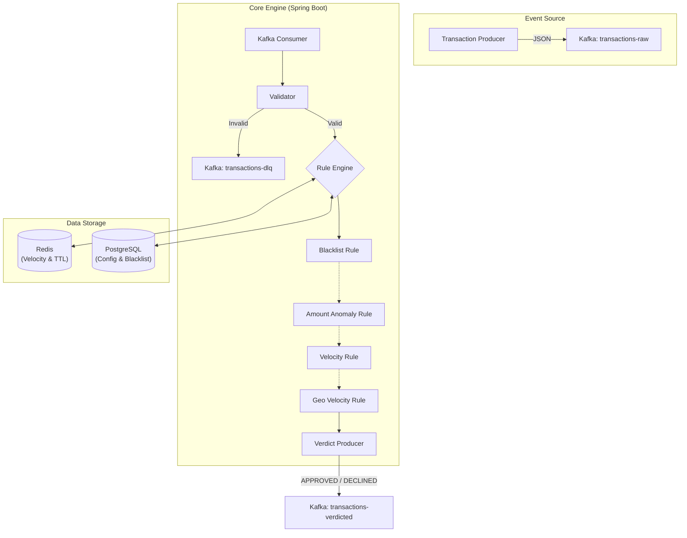

<div align="center">
  
  <h1>🛡 Aegis Fraud-Shield</h1>
  <p><strong>Enterprise-Grade Real-Time Fraud Detection Engine</strong></p>
  
  <p>
    
    
    
    
    
  </p>
</div>

---

## 📖 Overview

Aegis Fraud-Shield is a high-performance system designed to evaluate financial transactions in real-time. It detects anomalies, velocity spikes, and blacklisted entities using a flexible *Chain of Responsibility* rule engine. 

### ✨ Key Features

- ⚡️ Low Latency: In-memory and Redis caching for blazing fast validations.
- 🔗 Event-Driven: Fully decoupled, scalable architecture using Apache Kafka.
- 🧱 Extensible Rules Execution: Easily plug in new fraud detection strategies without modifying the core.
- 📊 Rich Observability: Built-in Micrometer, Prometheus, and Grafana stack for monitoring TPS, latency, and rule triggers.
- 🌐 Dynamic Configuration: Adjust fraud thresholds on-the-fly via REST API with zero downtime.
- 🛠 Automated Generation: Integrated synthetic transaction producer for immediate load testing.

---

## 🏗 Architecture



---

## 🚦 Fraud Detection Rules

| Rule | Description | Backing Store | Time Complexity |
|---|---|---|---|
| Blacklist | O(1) checks against known malicious IPs and Card BINs | PostgreSQL + Memory | O(1) |
| Amount Anomaly| Flags transactions exceeding highly configurable risk limits | Memory / DB Sync | O(1) |
| Velocity | Detects high-frequency spending patterns per account using TTL counters | Redis | O(1) |
| Geo-Velocity | Prevents "impossible travel" by evaluating IP geos within timeframes | Redis | O(1) |

---

## 🚀 Getting Started

### 1. Prerequisites
- Java 21 or higher
- Docker & Docker Compose
- Maven (or use the included `./mvnw` wrapper)

### 2. Launch Infrastructure
Start all necessary dependency services (Kafka, Zookeeper, Redis, PostgreSQL, Prometheus, Grafana) with a single command:
```bash
docker-compose up -d
```

### 3. Run the Core Application
The application automatically applies database migrations using Flyway on startup.
```bash
# Wait a few seconds for Kafka & DB to initialize
./mvnw spring-boot:run
```

---

## 🔗 API Integration & Dashboard

Explore and interact with the REST API using the embedded Swagger UI:  
👉 `http://localhost:8080/swagger-ui.html`

### 🎮 Load Generation
Generate synthetic transaction data directly via cURL to observe the engine's behavior under load:
```bash
curl -X POST "http://localhost:8080/api/v1/producer/generate?count=1000"
```

### 📈 Monitoring Metrics
Observe system metrics in real-time through Grafana:
- 🌐 URL: `http://localhost:3000`
- 🔒 Credentials: `admin` / `admin`
*(The Aegis dashboard is pre-provisioned under the "Dashboards" tab)*

---

## 🧪 Testing
The project includes an extensive suite of 40+ unit tests using JUnit 5 and Mockito. To execute:
```bash
./mvnw test
```