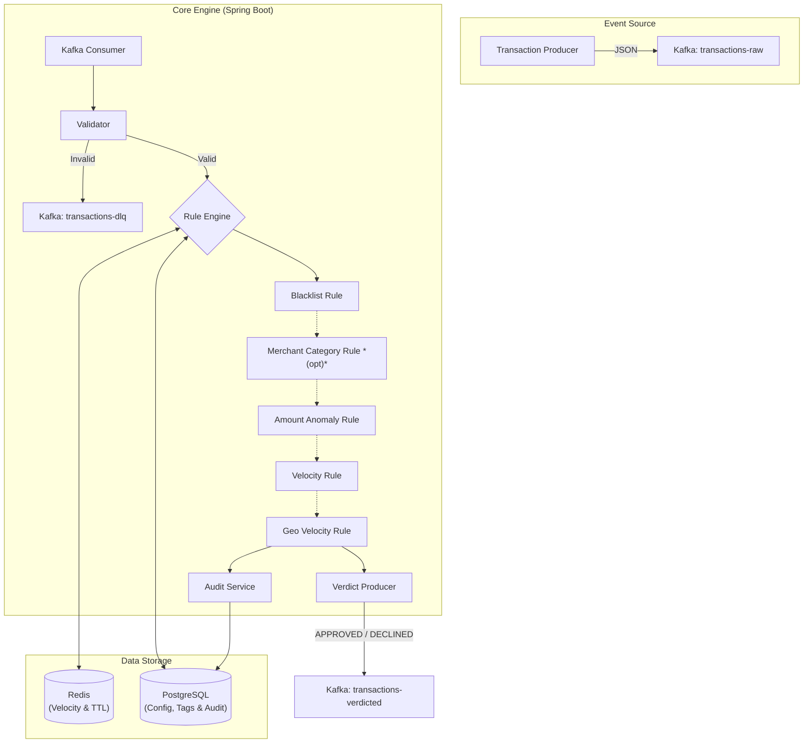

<div align="center">
  
  <h1>🛡 Aegis Fraud-Shield</h1>
  <p><strong>Enterprise-Grade Real-Time Fraud Detection Engine</strong></p>
  
  <p>
    
    
    
    
    
    
  </p>
</div>

---

## 📖 Overview

Aegis Fraud-Shield is a high-performance system designed to evaluate financial transactions in real-time. It detects anomalies, velocity spikes, and blacklisted entities using a flexible *Chain of Responsibility* rule engine. 

### ✨ Key Features

- ⚡️ **Low Latency:** In-memory and Redis caching for blazing fast validations.
- 🔗 **Event-Driven:** Fully decoupled, scalable architecture using Apache Kafka.
- 🧱 **Extensible Rules Execution:** Easily plug in new fraud detection strategies without modifying the core.
- 📊 **Rich Observability:** Built-in Micrometer, Prometheus, and Grafana stack for monitoring TPS, latency, and rule triggers.
- 🌐 **Dynamic Configuration:** Adjust fraud thresholds on-the-fly via REST API with zero downtime. Rule configs are backed by PostgreSQL with `@OneToMany` metadata tags.
- 📝 **Comprehensive Audit Log:** Every processed transaction is durably recorded with its final verdict, risk score, and triggered reasons. Easily query paginated stats via the Audit API.
- 🛡️ **Robust Error Handling:** A global `@RestControllerAdvice` ensures all API errors (e.g., validation failures, 404s, 409 Conflicts) return a strict, predictable JSON structure.
- 🛠 **Automated Generation:** Integrated synthetic transaction producer for immediate load testing.
- 🎯 **Risk Scoring:** Numeric risk score aggregation across all rules — provides granular risk assessment beyond binary verdicts.
- ✅ **Strict Validation:** ISO 4217 currency format enforcement and comprehensive input validation before rule evaluation.

---

## 🏗 Architecture


```mermaid
graph TB
    subgraph "Event Source"
        P["Transaction Producer"] -->|JSON| KIn["Kafka: transactions-raw"]
    end

    subgraph "Core Engine (Spring Boot)"
        C["Kafka Consumer"] --> V["Validator"]
        V -->|Invalid| KDLQ["Kafka: transactions-dlq"]
        V -->|Valid| RE{"Rule Engine"}
        
        RE --> R1["Blacklist Rule"]
        R1 -.-> R2["Merchant Category Rule *(opt)*"]
        R2 -.-> R3["Amount Anomaly Rule"]
        R3 -.-> R4["Velocity Rule"]
        R4 -.-> R5["Geo Velocity Rule"]
        
        R5 --> RP["Verdict Producer"]
        R5 --> AS["Audit Service"]
    end

    subgraph "Data Storage"
        Redis[("Redis<br/>(Velocity & TTL)")]
        PG[("PostgreSQL<br/>(Config, Tags & Audit)")]
    end

    RE <--> Redis
    RE <--> PG
    AS --> PG

    RP -->|APPROVED / DECLINED| KOut["Kafka: transactions-verdicted"]
```

---

## 🚦 Fraud Detection Rules

| Rule | Description | Risk Score | Backing Store | Enabled by default |
|---|---|---|---|---|
| Blacklist | O(1) checks against known malicious IPs and Card BINs | 100 (DECLINED) | PostgreSQL + Memory | ✅ |
| Amount Anomaly | Flags transactions exceeding configurable risk limits | 50 / 100 | Memory | ✅ |
| Velocity | Detects high-frequency spending patterns per account | 100 (DECLINED) | Redis | ✅ |
| Geo-Velocity | Prevents "impossible travel" by evaluating country changes | 50 (MANUAL_REVIEW) | Redis | ✅ |
| Merchant Category | Blocks or flags transactions by merchant category (gambling, crypto…) | 50 / 100 | PostgreSQL + Memory | ⚙️ opt-in |

Each rule contributes a numeric `riskScore` to the total. The `totalRiskScore` in the verdict response represents the aggregate risk level across all evaluated rules.

> **Enabling Merchant Category Rule**  
> The rule is opt-in and costs zero resources when disabled. To activate, set the following property:  
> ```yaml
> fraud:
>   rules:
>     merchant-category:
>       enabled: true
> ```
> Default blocked categories: `darkweb`, `illegal` → **DECLINED**  
> Default review categories: `gambling`, `crypto`, `adult`, `firearms`, `wire_transfer` → **MANUAL_REVIEW**  
> Both lists can be updated at runtime via `PUT /api/v1/rules/config/merchant-category/{decline|review}`.

---

## 🚀 Getting Started

### 1. Prerequisites
- Java 21 or higher
- Docker & Docker Compose
- Maven (or use the included `./mvnw` wrapper)

### 2. Launch Infrastructure & App
Start the database, Redis, Kafka, Prometheus, Grafana, and the application itself using the multi-stage Docker build:
```bash
docker-compose up --build -d
```
*Note: The application container will intelligently wait for PostgreSQL and Kafka health checks to pass before starting.*

---

## 🔗 API Integration & Dashboard

Explore and interact with the REST API using the embedded Swagger UI:  
👉 `http://localhost:8080/swagger-ui.html`

### 🎮 Load Generation
Generate synthetic transaction data directly via cURL to observe the engine's behavior under load:
```bash
curl -X POST "http://localhost:8080/api/v1/producer/generate?count=1000"
```

### 📊 Querying the Audit Log
The `AuditService` powers a comprehensive REST API to view fraud statistics derived from stream aggregations and JPQL:
```bash
curl "http://localhost:8080/api/v1/audit/stats/last-24h"
```

### 📈 Monitoring Metrics
Observe system metrics in real-time through Grafana:
- 🌐 URL: `http://localhost:3000`
- 🔒 Credentials: `admin` / `admin`
*(The Aegis dashboard is pre-provisioned under the "Dashboards" tab)*

---

## 🧪 Testing
The project includes an extensive suite of 60+ unit tests using JUnit 5 and Mockito. This includes rigorous `@ParameterizedTest` suites with `@MethodSource` and `@CsvSource` for boundary-value checking, and Mockito `@Spy` assertions. To execute:
```bash
./mvnw test
```