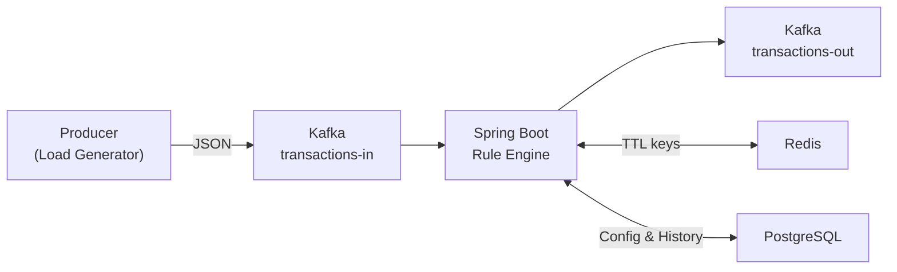
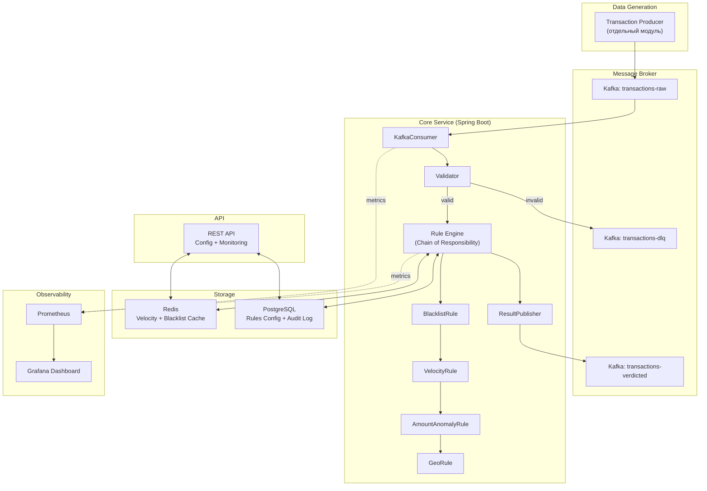
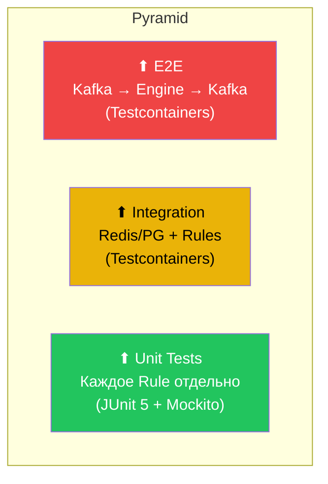

# Aegis Fraud-Shield — Полный план проекта

## 🎯 Общая оценка проекта

### Подходит ли проект для стажировки в Т-Банк?

**Да, отлично подходит.** Вот почему:

| Критерий | Оценка | Комментарий |
|---|---|---|
| Релевантность домену | ⭐⭐⭐⭐⭐ | Финтех, фрод-детект — прямое попадание в бизнес банка |
| Технологический стек | ⭐⭐⭐⭐⭐ | Kafka, Redis, PostgreSQL, Spring Boot — стек Т-Банка |
| Сложность | ⭐⭐⭐⭐ | Достаточно сложный, чтобы впечатлить, но реализуемый |
| Паттерны проектирования | ⭐⭐⭐⭐⭐ | Chain of Responsibility, Strategy, Event-Driven |
| Вопросы на собеседовании | ⭐⭐⭐⭐⭐ | Каждый компонент — тема для глубокого обсуждения |

> [!IMPORTANT]
> Главное преимущество — проект покрывает **все ключевые темы**, которые Т-Банк спрашивает на собеседованиях: многопоточность, работа с data structures, интеграция с брокерами сообщений, кэширование, паттерны проектирования.

---

## 🏗️ Архитектура: анализ и улучшения

### Текущая схема (из спецификации)



### Рекомендуемая улучшенная архитектура



### Ключевые улучшения архитектуры

1. **Dead Letter Queue (DLQ)** — топик `transactions-dlq` для сообщений, которые не удалось обработать (невалидный JSON, таймауты). Показывает зрелость подхода.
2. **Слой валидации** перед Rule Engine — сначала проверяем формат, потом бизнес-логику.
3. **Observability Stack** (Prometheus + Grafana) — это **must-have** фича, которая визуально впечатляет.
4. **Разделение Producer** в отдельный Maven-модуль.

---

## ✅ Аудит фич: что оставить, что добавить, что убрать

### Оставить (из твоего списка)

| Фича | Статус | Почему |
|---|---|---|
| Асинхронная обработка через Kafka | ✅ Оставить | Ядро системы |
| Rule Engine (Chain of Responsibility) | ✅ Оставить | Главный паттерн, о котором будут спрашивать |
| Blacklist по IP и BIN | ✅ Оставить | Простое и понятное правило |
| Velocity Check (Redis + TTL) | ✅ Оставить | Отличная демонстрация работы с Redis |
| REST API для конфигурации | ✅ Оставить | Показывает CRUD + динамическое управление |
| Метрики | ✅ Оставить | Обязательно для production-grade проекта |

### Изменить

| Фича | Рекомендация |
|---|---|
| **Trie для черных списков** | ⚠️ **Упростить.** Trie — это красиво на бумаге, но `HashSet` будет работать быстрее для точных совпадений IP/BIN. Trie имеет смысл только для поиска по **префиксу** (например, блокировка целых подсетей `192.168.*`). **Рекомендация:** используй `HashSet` как основную структуру + реализуй Trie **отдельно** для поиска по подсетям — и объясни на собеседовании, **почему** выбрал каждую структуру. Это покажет глубину понимания. |

### Добавить

| Фича | Зачем | Сложность |
|---|---|---|
| **Amount Anomaly Rule** | Блокировка транзакций, превышающих порог (например, >100 000 ₽ за раз). Самое простое правило, показывает расширяемость. | 🟢 Легко |
| **Geo-Velocity Rule** | Если 2 транзакции с одного аккаунта из разных стран за < 1 час — подозрительно. Wow-фича для собеседования. | 🟡 Средне |
| **Swagger/OpenAPI** | Авто-документация API. Стандарт индустрии, добавляется за 5 минут. | 🟢 Легко |
| **Grafana Dashboard** | Визуализация метрик. Один скриншот дашборда стоит тысячи слов в резюме. | 🟢 Легко |
| **Integration Tests (Testcontainers)** | Тесты с реальными Docker-контейнерами Kafka/Redis/PG. Т-Банк использует Testcontainers. | 🟡 Средне |
| **Liquibase/Flyway миграции** | Версионирование БД. Стандарт в enterprise. | 🟢 Легко |

### НЕ добавлять (overkill для pet-проекта стажировки)

| Фича | Почему нет |
|---|---|
| ML-модель для скоринга | Слишком сложно, уведёт фокус с backend |
| Kubernetes/Helm | Не нужно для pet-проекта, Docker Compose достаточно |
| gRPC между сервисами | Один сервис — нет смысла |
| Spring Cloud / Service Discovery | Overkill, у тебя монолит + Kafka |
| OAuth2/JWT | Нет фронтенда и пользователей |

---

## 🧪 Стратегия тестирования (без реальных данных)

> [!IMPORTANT]
> У тебя нет реальных транзакций — и **это абсолютно нормально**. В реальных банках тестирование на синтетических данных — стандартная практика.

### 1. Transaction Generator (Producer)

Генератор создаёт **реалистичные** синтетические транзакции. Это отдельный модуль проекта.

```
Формат транзакции (JSON):
{
  "transactionId": "uuid",
  "accountId": "ACC-12345",
  "cardBin": "427600",       // первые 6 цифр карты
  "amount": 15000.00,
  "currency": "RUB",
  "merchantId": "MERCH-001",
  "merchantCategory": "electronics",
  "sourceIp": "185.45.67.89",
  "country": "RU",
  "timestamp": "2026-03-19T18:30:00Z"
}
```

**Стратегия генерации:**

| Тип данных | Процент | Описание |
|---|---|---|
| Нормальные | 70% | Обычные транзакции в допустимых пределах |
| Velocity-аномалии | 10% | 10+ транзакций с одного аккаунта за минуту |
| Blacklisted IP/BIN | 10% | Транзакции с IP/BIN из чёрного списка |
| Amount-аномалии | 5% | Суммы > порогового значения |
| Geo-аномалии | 5% | Два города/страны за 30 минут |

### 2. Пирамида тестирования



### 3. Конкретные тест-кейсы

#### Unit Tests (JUnit 5 + Mockito)

```
BlacklistRuleTest:
  ✓ should DECLINE transaction with blacklisted IP
  ✓ should DECLINE transaction with blacklisted BIN
  ✓ should pass transaction with clean IP and BIN
  ✓ should handle null IP gracefully

VelocityRuleTest:
  ✓ should DECLINE when >5 transactions per minute
  ✓ should APPROVE when ≤5 transactions per minute
  ✓ should track per-account, not globally
  ✓ should reset counter after TTL expires

AmountAnomalyRuleTest:
  ✓ should flag transaction above threshold
  ✓ should approve transaction below threshold

RuleEngineTest:
  ✓ should execute rules in correct order
  ✓ should stop chain on first DECLINE
  ✓ should return MANUAL_REVIEW when ≥2 warnings
  ✓ should APPROVE when no rules triggered
```

#### Integration Tests (Testcontainers)

```
RedisCacheIntegrationTest:
  ✓ should increment velocity counter correctly
  ✓ should expire keys after TTL
  ✓ should handle concurrent access

KafkaIntegrationTest:
  ✓ should consume from transactions-raw topic
  ✓ should produce verdict to transactions-verdicted topic
  ✓ should send invalid messages to DLQ

PostgresConfigIntegrationTest:
  ✓ should load rule thresholds from DB
  ✓ should update thresholds via REST API
```

### 4. Нагрузочное тестирование

Используй сам Producer для нагрузки:

| Сценарий | Цель | Метрика |
|---|---|---|
| Стресс-тест | 1000 сообщений/сек в Kafka | Throughput, latency P50/P95/P99 |
| Длительный тест (5 мин) | Проверка утечек памяти | Heap usage, GC pauses |
| Пиковая нагрузка | 5000 сообщений/сек, burst | Backpressure, consumer lag |

Метрики снимай через **Micrometer → Prometheus → Grafana**.

---

## 📁 Структура проекта

```
fraudshield/
├── docker-compose.yml
├── grafana/
│   └── dashboards/
│       └── fraud-dashboard.json      # Готовый дашборд
├── prometheus/
│   └── prometheus.yml                # Конфиг Prometheus
├── producer/                         # Опционально: отдельный модуль
│   └── TransactionProducer.java
├── src/main/java/io/github/mahfaas/fraudshield/
│   ├── FraudshieldApplication.java
│   ├── config/
│   │   ├── KafkaConfig.java
│   │   ├── RedisConfig.java
│   │   └── SwaggerConfig.java
│   ├── model/
│   │   ├── Transaction.java          # DTO входящей транзакции
│   │   ├── Verdict.java              # Enum: APPROVED, DECLINED, MANUAL_REVIEW
│   │   └── VerdictedTransaction.java # Транзакция + вердикт + причина
│   ├── kafka/
│   │   ├── TransactionConsumer.java   # @KafkaListener
│   │   └── VerdictProducer.java       # KafkaTemplate.send()
│   ├── validation/
│   │   └── TransactionValidator.java  # Проверка формата перед Rule Engine
│   ├── engine/
│   │   ├── Rule.java                  # Интерфейс правила
│   │   ├── RuleEngine.java            # Оркестрация цепочки правил
│   │   ├── RuleResult.java            # Результат одного правила
│   │   └── rules/
│   │       ├── BlacklistRule.java
│   │       ├── VelocityRule.java
│   │       ├── AmountAnomalyRule.java
│   │       └── GeoVelocityRule.java
│   ├── blacklist/
│   │   ├── BlacklistService.java      # CRUD операции
│   │   ├── BlacklistRepository.java   # JPA репозиторий
│   │   └── BlacklistEntity.java       # JPA сущность
│   ├── api/
│   │   ├── BlacklistController.java   # REST: /api/v1/blacklist
│   │   ├── RuleConfigController.java  # REST: /api/v1/rules/config
│   │   └── MetricsController.java     # REST: /api/v1/metrics
│   └── metrics/
│       └── FraudMetrics.java          # Micrometer counters/gauges
├── src/main/resources/
│   ├── application.yaml
│   └── db/migration/                  # Flyway миграции
│       └── V1__init_schema.sql
└── src/test/java/io/github/mahfaas/fraudshield/
    ├── engine/rules/
    │   ├── BlacklistRuleTest.java
    │   ├── VelocityRuleTest.java
    │   └── AmountAnomalyRuleTest.java
    ├── engine/RuleEngineTest.java
    ├── integration/
    │   ├── KafkaIntegrationTest.java
    │   └── RedisIntegrationTest.java
    └── api/
        └── BlacklistControllerTest.java
```

---

## 🗓️ Roadmap: поэтапная реализация

### Фаза 1 — Ядро (3–5 дней)

- [ ] Модель данных: `Transaction`, `Verdict`, `VerdictedTransaction`
- [ ] Интерфейс `Rule` + `RuleEngine` (Chain of Responsibility)
- [ ] `BlacklistRule` (на `HashSet`, данные в памяти)
- [ ] `AmountAnomalyRule` (простейшее правило с порогом)
- [ ] Unit-тесты на все правила
- [ ] Flyway: `V1__init_schema.sql`

### Фаза 2 — Интеграции (3–5 дней)

- [ ] Kafka Consumer + Producer
- [ ] Redis: Velocity Check с TTL
- [ ] PostgreSQL: сохранение конфигурации правил
- [ ] `VelocityRule` (Redis-based)
- [ ] Integration Tests с Testcontainers

### Фаза 3 — API и генератор (2–3 дня)

- [ ] REST API: CRUD для Blacklist
- [ ] REST API: управление порогами правил
- [ ] Swagger/OpenAPI
- [ ] Transaction Producer (генератор нагрузки)

### Фаза 4 — Observability и полировка (2–3 дня)

- [ ] Micrometer метрики
- [ ] Prometheus в docker-compose
- [ ] Grafana dashboard (JSON-конфиг)
- [ ] `GeoVelocityRule` (бонусная фича)
- [ ] Нагрузочное тестирование
- [ ] README.md с архитектурными диаграммами

---

## 💡 Фишки для собеседования

### О чём ты сможешь говорить

1. **«Почему Chain of Responsibility, а не Strategy?»** — Потому что правила выполняются последовательно, и каждое может прервать цепочку при DECLINE. Strategy подходит для взаимозаменяемых алгоритмов, а у нас — конвейер.

2. **«Почему Redis, а не ConcurrentHashMap?»** — ConcurrentHashMap умрёт при рестарте приложения. Redis обеспечивает персистентность между перезагрузками + TTL из коробки + готовность к горизонтальному масштабированию.

3. **«Почему Kafka, а не RabbitMQ?»** — Kafka гарантирует порядок сообщений внутри партиции, поддерживает replay (повторное чтение) и масштабируется горизонтально через партиционирование.

4. **«Как обеспечить exactly-once обработку?»** — Можно обсудить идемпотентность (проверка `transactionId`), Kafka transactions, и паттерн Outbox.

5. **«Как масштабировать Rule Engine?»** — Увеличить partition count в Kafka + запустить N инстансов Consumer Group. Каждый инстанс обрабатывает свой набор партиций.

---

## ⚠️ Чего НЕ стоит делать

1. **Не пиши фронтенд** — Grafana заменяет UI. Фронт отвлечёт от backend.
2. **Не усложняй ML** — Порог + правила достаточно. ML-модель — отдельный проект.
3. **Не делай несколько микросервисов** — Один сервис + Kafka уже показывает event-driven архитектуру.
4. **Не используй Spring Boot 4.0.3** — он ещё слишком новый и может иметь проблемы с зависимостями. Рекомендую **Spring Boot 3.3.x** (стабильная LTS-подобная версия, используется в production).

---

## 📝 Текущее состояние проекта

Проект инициализирован: Spring Boot 4.0.3, Java 21, зависимости подключены (Kafka, Redis, JPA, Validation, Web). Docker Compose настроен для PostgreSQL, Redis, Kafka + Zookeeper.

> [!WARNING]
> **Spring Boot 4.0.3** — очень свежая версия. Многие библиотеки (Testcontainers старые адаптеры, некоторые Kafka-клиенты) могут быть не полностью совместимы. Рассмотри откат до **3.3.x** или **3.4.x** для стабильности.
